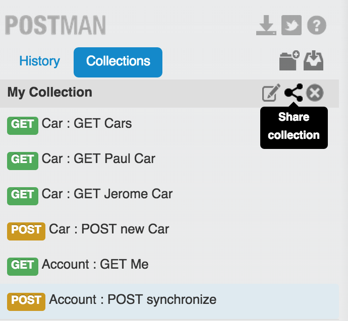
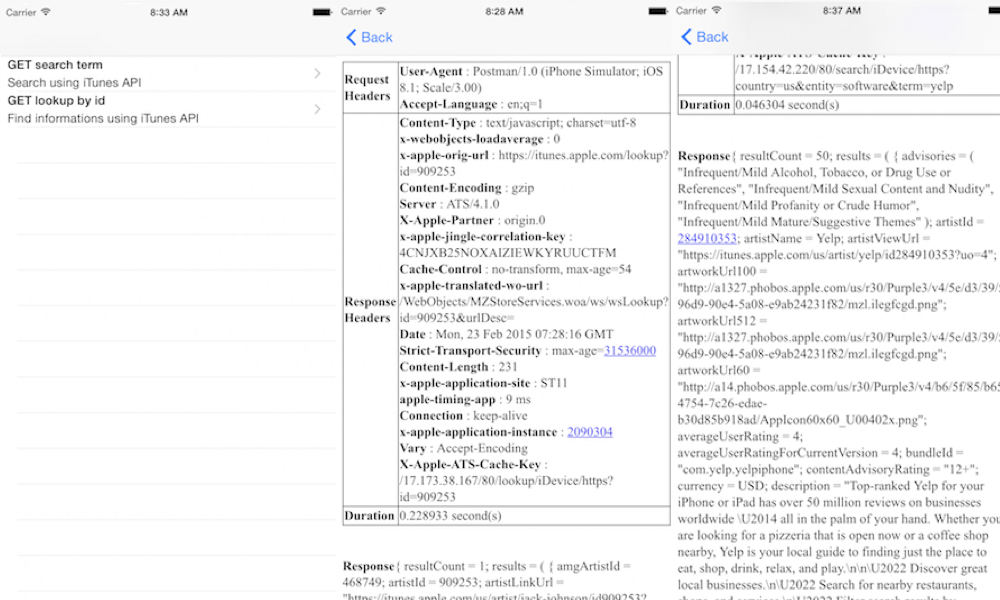

# postman
Postman iOS app to manipulate Postman collections

#aims of that projet
* execute collection of request in a mobility context (wifi / 4G / Edge / train?)
* follow WebService state
* Have fun with a first full opensourced app

#Participating ?
* respect gitflow, 
* make your pull request on feature branches 

#How to export collections ?

#How to import collections in app?
- Just drag and drop in your app. (simulator),
- by email ? "Open In" will be an option for that file. 

#Next ?
* [ ] add more POST request to collection
* [ ] add POST request with parameters (form-dat / x-www-form-urlencoded / raw (TEXT / JSON / XML / HTML)
* [ ] add a way to edit request
* [ ] add custom headers support from POSTMAN collection.request
* [ ] add basic Auth support
* [x] add file support (to be able to open application with a custom postman collection)
* [ ] add a method to increase data persitance (actually, just the last imported collection is persist)
* [ ] add a way perform multiple serial requests

#Screenshots 
  
